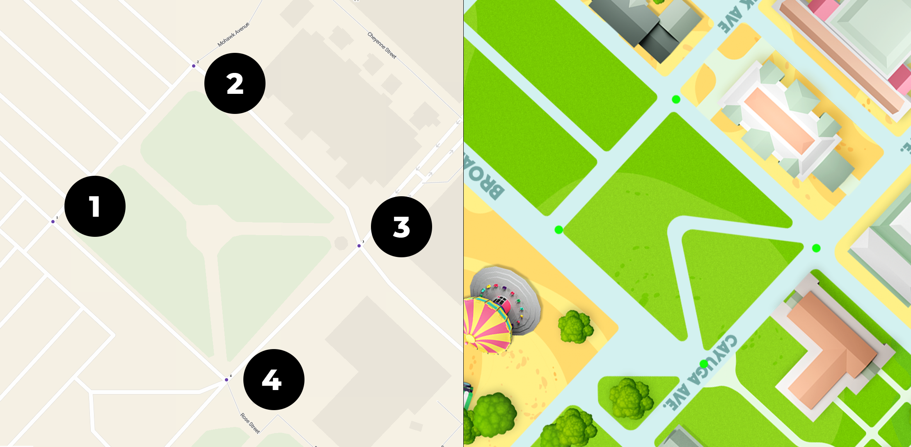

# NYSFair (Ionic)

## Build APK for Android testing

### Build app

```sh
ionic capacitor build android --prod
```

### Open Android Studio

Go to `Build` > `Build Bundle(s)/APK(s)` > `Build APK(s)`. Then locate at `android/app/build/outputs/apk/debug/app-debug.apk`

### Install on device

```
Go to Settings > Apps & notifications.
Tap Advanced > Special app access.
Tap Install unknown apps.
Select the app (like Chrome or File Manager) you'll use to install the APK.
Enable Allow from this source.
```

## Generate map

### 1. Create new QGIS project

Open QGIS, select `Project` -> `New`.

### 2. Add OpenStreetMap

From the left `Browser` sidebar, right-click on `XYZ Tiles -> OpenStreetMap` and select `Add Layer to Project`.

### 3. Go to NYSFair location on OpenStreetMap

Switch to `EPSSG:4326` in the lower right.  
Then enter the coordinates below in the `Coordinate` text input:

`-76.215325,43.055330`

or

`-76.22191,43.07350,-8484984.642,5323165.667`

### 4. Georeference raster

Go to `Raster` -> `Georeferencer...` to load image, and add points on the same location as the reference image.  
Make sure to add points in `EPSG:3857` format.

#### Coordinates Table

| Point   | Original Lng      | Original Lat     | Converted X           | Converted Y           |
|---------|-------------------|------------------|-----------------------|-----------------------|
| Point 1 | `-76.2198276`     | `43.0722346`     | `-8484752.396783099`  | `5322973.160658372`   |
| Point 2 | `-76.2189076`     | `43.072978`      | `-8484649.982851569`  | `5323086.447680906`   |
| Point 3 | `-76.2178267`     | `43.072118`      | `-8484529.65761397`   | `5322955.39206253`    |
| Point 4 | `-76.2186931`     | `43.0714773`     | `-8484626.104820793`  | `5322857.756822213`   |

See map reference points:



#### Convert locations

Use [convert-location](scripts/convert-location) tool to convert if coordinates change:

```sh
docker build -t convert-location -f Dockerfile.convert-location .
docker run --rm convert-location -76.2198276 43.0722346
```

### 5. Generate .tif file

- Transformation Type: Linear
- Resampling method: Nearest neighbour
- Target SRS: EPSG:3857 – Web Mercator

Run and it will export a `.tif` file, which you should move into directory [scripts/generate-map-tiles/input](scripts/generate-map-tiles/input/).

### 6. Convert .tif to Raster Tiles (XYZ format)

From `scripts/generate-map-tiles` directory, run:
            
```sh
docker build -f Dockerfile.gdal2tiles -t gdal2tiles-gdal38 .
```

```sh
docker run --rm \
  -v $PWD:/data \
  gdal2tiles-gdal38 \
  gdal2tiles.py \
    --profile=mercator \
    --xyz \
    --tilesize=512 \
    --resampling=lanczos \
    --zoom=13-19 \
    --webviewer=none \
    input/Map_Design_Angled_3x_modified.tif \
    output/map-tiles
```

Optional, use `--tiledriver=webp` to also export a webp version that can be used for modern browsers.
